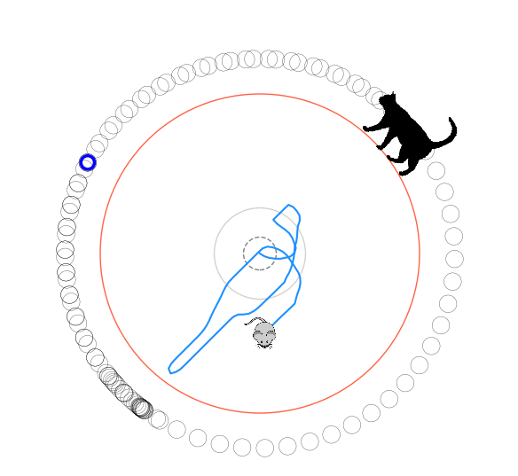

# Solving Numberphile’s Cat and Mouse puzzle using the DDPG and A2C reinforcement learning algorithms

  

## Overview

A much more thorough writeup of this project is [on my blog here](https://www.declanoller.com/2019/08/30/solving-numberphiles-cat-and-mouse-puzzle-using-the-ddpg-and-a2c-reinforcement-learning-algorithms/). Below are details about the code that may help if you want to modify or reproduce it.

## Typical use
