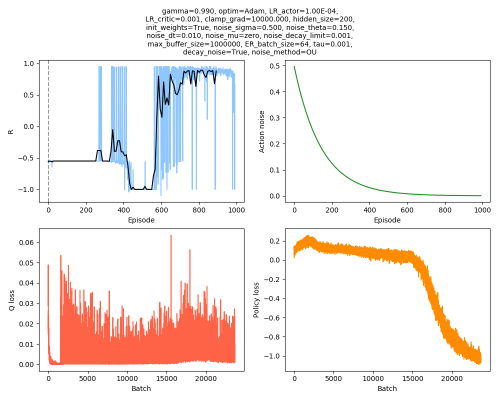

# Solving Numberphile’s Cat and Mouse puzzle using the DDPG and A2C reinforcement learning algorithms

<p align="center">
  
</p>

## Overview

A much more thorough writeup of this project is [on my blog here](https://www.declanoller.com/2019/08/30/solving-numberphiles-cat-and-mouse-puzzle-using-the-ddpg-and-a2c-reinforcement-learning-algorithms/). Below are details about the code that may help if you want to modify or reproduce it.

## Typical use

The directory structure is like this:

```
.
├── misc
├── output
├── scripts
└── src
```

Scripts should put in the `scripts/` folder, and all should have `import path_utils` as their first line. `path_utils.py` just adds the other project folders to `sys.path`, allowing the script to call other functions that live in `src/`, as well as providing paths for saving the output files to. By default, all output will be saved to `output/misc_runs/`. If the script is in `scripts/` and imports `path_utils`, it can be called from wherever. There are obviously more robust ways to handle paths/envs/etc, but this was easy and works.

A very simple script that would train it for 1000 episodes of 100 maximum steps each, using DDPG, could be:

```
import path_utils
from CatMouse_DDPG import CatMouse_DDPG

run_kwargs = {
	'noise_sigma' : 0.5,
	'max_ep_steps' : 100,
	'N_steps' : 100,
	'cat_speed_rel' : 3.0,
	'decay_noise' : True
}

cm = CatMouse_DDPG(**run_kwargs)
cm.train(1000, 100)
```

It will create a dir for the run in `output/misc_runs/`. In that dir, it will create a `params_passed.json` file (which has a dict of only the params you've specifically passed), a `params_all.json` file (that contains all the params used by the class in that run, so you can see its defaults/etc), and a datestamped file of the form `CatMouse_DDPG_03-09-2019_14-44-01_train.png`, which shows the training progress:

<p align="center">
  
</p>

This image will get repeatedly replot during the training, so you can see it update in real time.


## Hyperparameter search

The above sample script only runs a single instance of it with a cat speed of 3.0. Unfortunately, for higher cat speeds, it's less reliable, and you often need to tune the hyperparameters and try the same run multiple times. For this purpose, I created a few helpful functions that live in `src/aux_functions.py`.

One helpful one is `aux_functions.hyperparam_search_const()`. For this, you pass it a dict of the "constant parameters", and and then a dict of the parameters you want to vary, and the list of their values you want them to take. For example, in `scripts/run_cm_DDPG.py`:

```
import path_utils
from CatMouse_DDPG import CatMouse_DDPG
import aux_functions

#################################### DDPG test noise
center_dict = {
	'train_class' : CatMouse_DDPG,
	'N_eps' : 3000,
	'max_ep_steps' : 100,
	'N_steps' : 100,
	'cat_speed_rel' : 3.2,
	'noise_sigma' : 0.5,
	'noise_theta' : 0.15
}

vary_dict = {
	'noise_sigma' : [0.05, 0.25, 0.8, 1.0],
	'noise_theta' : [0.01, 0.8],
}

aux_functions.hyperparam_search_const(
								aux_functions.run_train_sequence,
								center_dict,
								vary_dict,
								path_utils.get_output_dir(),
								N_runs=5,
								save_R = True,
								center_run = True
							)
```

This will use `center_dict` as the "baseline" parameters to run, but then change the value of the parameters in `vary_dict` one at a time. For each set of parameters, it'll run `N_runs` times (in this case, 5). It will also create a big dir that will hold all the dirs for the individual runs, and their results, and then plot the identical ones together, so you can more easily compare them.


## Ramping difficulty
